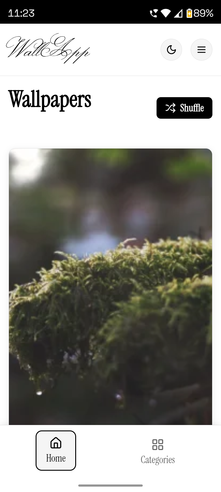
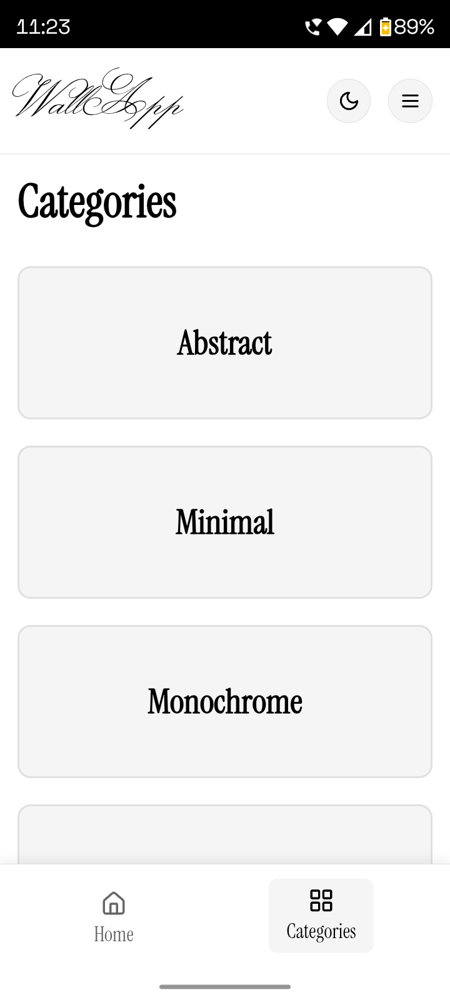
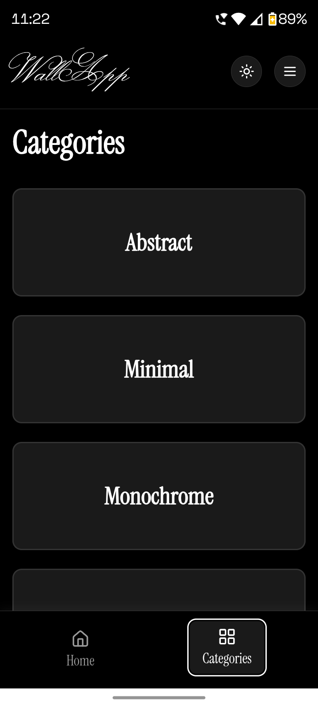
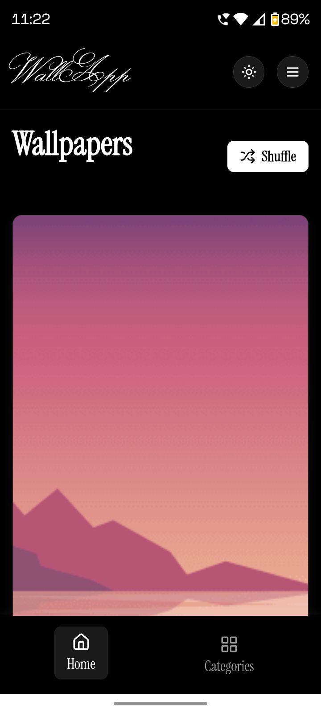

# WallApp

WallApp is a simple Android application that wraps the DebWallApp wallpaper website in a native WebView.  
It provides a lightweight interface for browsing.

## Features

- Lightweight and fast
- No ads
- No trackers
- Open-source

## Screenshots






## Installation

### GitHub Releases

Download the latest signed APK from GitHub Releases:

[](https://github.com/debojitsantra/Wallapp-Android/releases)

## Building from Source

### Requirements

- Android Studio or Android SDK tools
- JDK 17
- Gradle wrapper (included)

### Build Steps

Clone the repository:

```bash
git clone https://github.com/debojitsantra/Wallapp-Android.git
cd Wallapp-Android
```
Build the release APK:
```bash

./gradlew clean assembleRelease
```
## Website
This app displays content from:
https://debwallapp.pages.dev
The website content is not part of this repository.

## License

This project is licensed under the GNU General Public License v3.0 or later.
