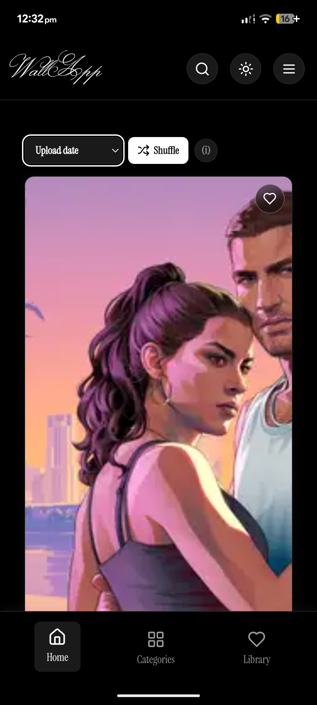
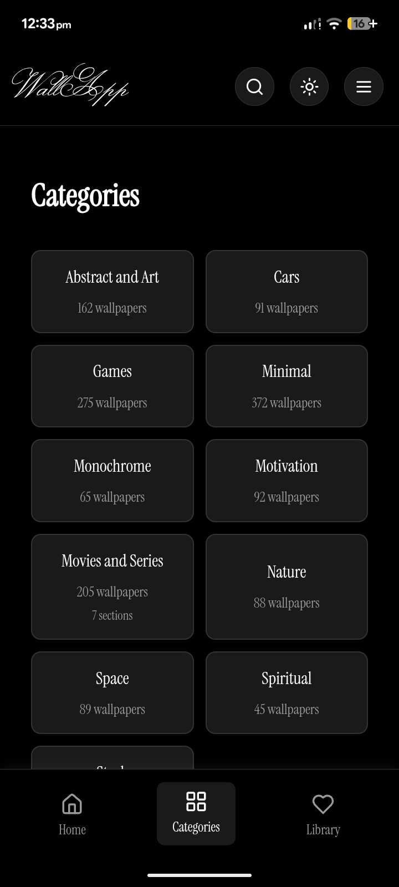
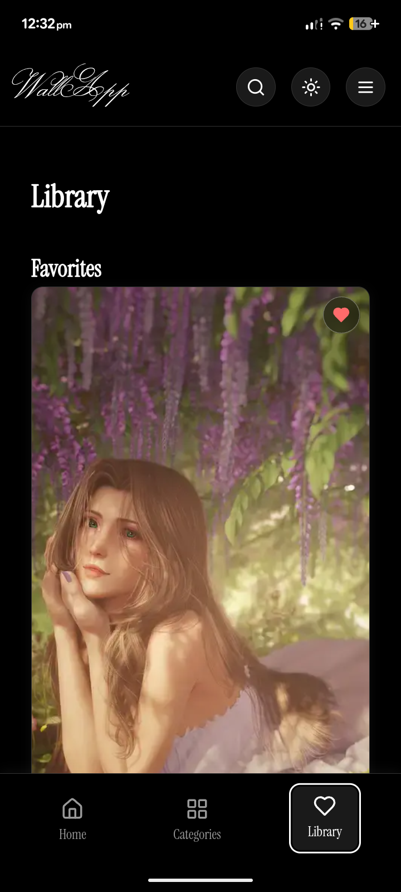
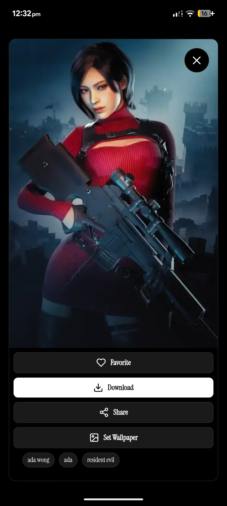
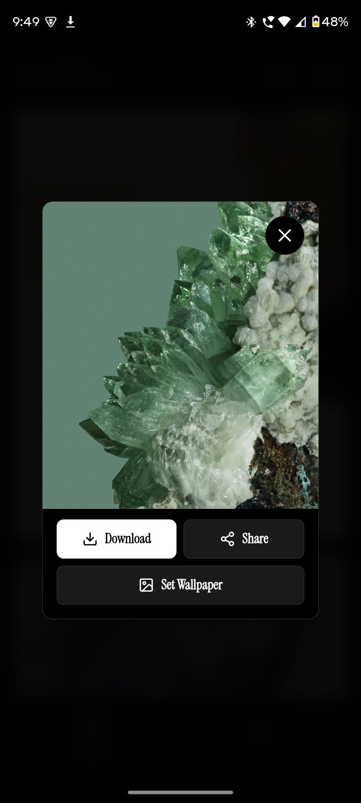

# Wallapp Android

[](https://f-droid.org/packages/com.debojit.wallapp/)
[](LICENSE)


**Wallapp Android** is a lightweight Android wrapper for **TheWallApp**, a wallpaper platform for browsing and downloading wallpapers.

The app loads the website inside a native **Android WebView** and extends it with native Android capabilities such as **setting wallpapers directly from the app**.

Website: https://thewallapp.pages.dev

---

## Features

- Browse wallpapers from **TheWallApp**
- Lightweight Android WebView wrapper
- Set wallpapers directly from the app
- Minimal UI

## Screenshots

<p align="center">
  
  
  
 
 

</p>

---

## Installation

### F-Droid

You can install the app from F-Droid.

[](https://f-droid.org/packages/com.debojit.wallapp)
    
## Build from Source

```bash
git clone https://github.com/debojitsantra/Wallapp-Android.git
cd Wallapp-Android
./gradlew assembleDebug
```
The APK will be generated in:
```bash
app/build/outputs/apk/debug/
```
You can also open the project directly in Android Studio if preferred.


## License

GPL 3.0 License — see [LICENSE](LICENSE).

---

## Author

**Debojit Santra**  
GitHub: https://github.com/debojitsantra
